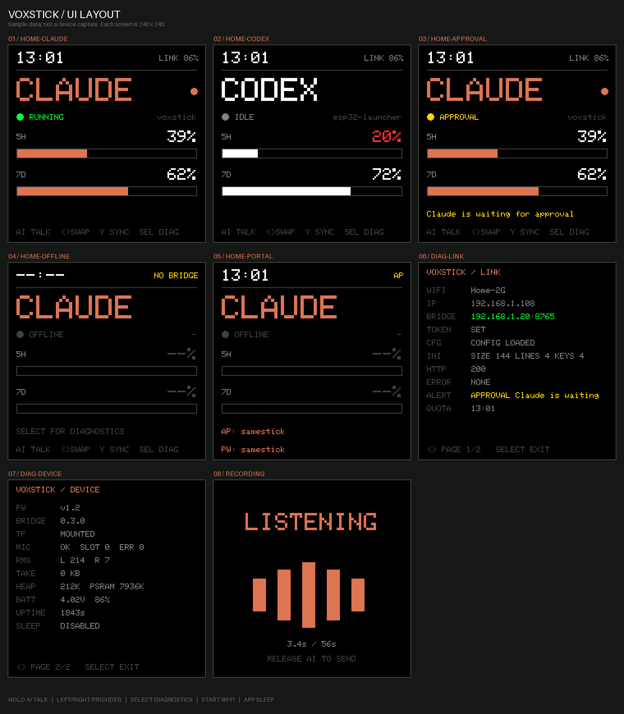

# VoxStick

[English](README.md)



跑在 S3AI Game（ESP32-S3）掌机上的桌面 AI agent 小终端。显示 Codex / Claude Code
当前在不在干活、5H / 7D 额度还剩多少，状态变化时响提示音。按住 AI 键说话，电脑上的
bridge 转写后自动填进对应的对话输入框。

设备侧是 240x240 屏、MSM261S 麦克风和 MAX98357A 功放；bridge 支持
Windows / macOS / Linux。

**设备不直接访问任何云服务。** 它只和局域网里的 bridge 说 HTTP；语音识别、额度读取、
粘贴注入都在电脑上完成。

## 结构

```
src/                  固件（Arduino + Arduino_GFX）
  main.cpp            UI、按键、休眠
  vox_audio.*         16 kHz 采集 + 提示音合成
  vox_bridge.*        /voxstick.ini 配置、HTTP、JSON 解析
bridge/               跨平台 Python 服务，仅标准库
  src/vox_stick/      服务本体
  tests/              117 个单元测试
  doctor.py           环境自检
  .env.example        配置模板
voxstick.ini.example  TF 卡配置模板
```

## 一、准备

- S3AI Game 一台、TF 卡一张、2.4 GHz Wi-Fi（ESP32-S3 不支持 5 GHz）
- 电脑上装好 Python 3.11+
- 腾讯云账号并开通**语音识别**服务，拿到 SecretId / SecretKey。也可以不用它，接自己的
  识别程序，见[语音转写](#语音转写)
- 可选：要显示 Claude 的 5H / 7D 用量，先在终端跑一次 `claude` 并 `/login`

## 二、启动 bridge

```bash
cd bridge
cp .env.example .env     # 然后填好各项
PYTHONPATH=src python -m vox_stick
```

加 `--hud` 会多开一个置顶的小状态窗。`--host` 和 `--port` 可覆盖默认值。

有问题先跑自检：

```bash
cd bridge
PYTHONPATH=src python doctor.py
```

`doctor.py` 会打印本机局域网地址，填到 TF 卡的 `bridge_host` 里。

### 配置项

`bridge/.env`，所有键都带 `VOX_STICK_` 前缀：

| 键 | 含义 |
|---|---|
| `BRIDGE_TOKEN` | 共享密钥，`voxstick.ini` 里要填同一个值 |
| `TENCENT_SECRET_ID` / `TENCENT_SECRET_KEY` | 腾讯云 ASR 凭据 |
| `ASR_ENGINE` | `16k_zh`（默认）、`16k_zh_dialect`、`16k_en`、`16k_yue`、`16k_ja` 等 |
| `PROVIDER` | `auto`（谁最近活跃显示谁）、`codex`、`claude` |
| `CLAUDE_USAGE` | `on` 打开 Claude 5H / 7D 读取，默认关闭 |
| `AUTO_ENTER` | `1` 表示粘贴后自动按回车 |
| `BRIDGE_HOST` / `BRIDGE_PORT` | 监听地址，默认 `0.0.0.0:8765` |
| `HUD` | `1` 打开桌面 HUD |
| `TRANSCRIBE_CMD` | 外部识别程序，优先级高于腾讯云 |

## 三、配置 TF 卡

把 `voxstick.ini.example` 复制到 TF 卡根目录并改名 `voxstick.ini`：

```ini
bridge_host=192.168.1.20      # doctor.py 打印的电脑 IP
bridge_port=8765
bridge_token=<和 .env 里同一个值>
auto_sleep_seconds=0          # 0 = 常亮当桌面监视器；10 = 十秒后休眠
```

## 四、烧录固件

```bash
pio run -e s3ai-voxstick
python package.py
```

用 Launcher 的 TF 卡文件浏览器安装 `dist/VoxStick-v1.2.bin`，或直接刷 app 分区：

```bash
python -m esptool --chip esp32s3 --port COM3 --baud 921600 \
  write_flash 0x10000 dist/VoxStick-v1.2.bin
```

## 五、配网

开机后按 **START**。所有 S3AI 应用共用同一个热点：

| 名称 | 密码 |
|---|---|
| `samestick` | `samestick` |

手机连上后一般会自动弹出页面（没弹就访问 `192.168.4.1`），选 Wi-Fi 填密码保存。
凭据存在 NVS 的 `voxstick-net` 命名空间。

随时按 START 都能换网，已连着网也能换。提交新密码后设备会先关掉热点去试连（屏幕显示
`TRYING NEW WIFI`），成功就保存；失败会恢复原来的网络，并用同样的名称密码把热点开回来，
手机自动重连后能看到错误原因。试连失败不会破坏原有配置。

保存的网络连不上超过 60 秒，设备下次开机会自动开一次配网。

## 按键

| 键 | 作用 |
|---|---|
| AI (GPIO0) | 按住说话，松开上传、转写并粘贴 |
| 左 / 右 | 首页切换 Codex / Claude；诊断页翻页 |
| Y | 立即刷新额度（`POST /quota/refresh`） |
| A | 清除当前提醒（`POST /event` `button_short`） |
| SELECT | 进出诊断页，两页：LINK（网络与错误）和 DEVICE（硬件状态） |
| START | 开关 Wi-Fi 配网 |
| APP (GPIO10) | 休眠 / 唤醒 |

右上角显示链路状态：`LINK` / `NO BRIDGE` / `NO WIFI` / `AP` / `WIFI TEST`。
provider 名字右边的圆点表示这一栏是 bridge 当前选中的 active provider。
额度剩余 ≤20% 时变红，其余为白色；进度条始终保持 provider 主色（Claude 橙、Codex 白）。
数据过期只在诊断页的 QUOTA 行标注。

首页只放 agent 相关信息：名称、状态、项目、额度、提醒。配置错误、HTTP 状态码、麦克风、
内存这些排查信息都在 SELECT 的两个诊断页里。

## 提示音

只有 agent 状态变化才响，录音相关状态一律不响。

| 状态 | 声音 |
|---|---|
| DONE | 880 Hz 80 ms，停 40 ms，1320 Hz 120 ms |
| ERROR | 240 Hz 100 ms，停 60 ms，重复 3 次 |
| APPROVAL | 600 Hz 100 ms，停 60 ms，800 Hz 100 ms |

同一个 `alert.event_id` 只响一次；没有 event_id 时退化成状态跳变检测。录音期间收到的
提醒直接丢弃，不排队。

## 语音转写

腾讯云**一句话识别** `SentenceRecognition`
（[文档](https://cloud.tencent.com/document/api/1093/35646)），TC3-HMAC-SHA256 签名，
用标准库手写实现，不依赖腾讯云 SDK。

- 设备录 16 kHz / 16 bit / 单声道 PCM，上限 **56 秒**（接口限制 60 秒、base64 后 3 MB）
- bridge 落盘成 WAV，先做静音和语音窗检测，太短或没人说话直接跳过，不浪费调用次数
- 识别成功后，bridge 打开所选 provider 对应的桌面应用并定位对话输入框，用 Ctrl+V 填入
  文字再还原剪贴板。目标不可用时保留转写并报告失败

想离线或换服务，设 `VOX_STICK_TRANSCRIBE_CMD`：命令从 stdin 收到录音会话 JSON（含
`audio_file` 路径），把文本打到 stdout 即可，优先级高于腾讯云。

## Claude / Codex 状态从哪来

- **Codex**：读 `~/.codex/sessions/**/*.jsonl`，额度来自 `token_count` 事件里的
  `rate_limits`（`window_minutes` 300 对应 5H，10080 对应 7D）。这不是官方额度 API。
- **Claude**：读 `~/.claude/projects/**/*.jsonl` 判断 RUNNING / DONE / APPROVAL / ERROR。
  5H / 7D 用量默认**关闭**；用 `VOX_STICK_CLAUDE_USAGE=on` 打开后会借 Claude Code 本机
  OAuth 凭据调用一个未公开接口，随时可能失效。关闭时设备显示 `--%`。

两者都先查进程，查不到再看会话文件 10 分钟内有没有写入——Windows 上两个 CLI 都是
`node.exe` 子进程，光靠进程名认不出来。

不管 `VOX_STICK_PROVIDER` 设成什么，`/state` 里 `codex` 和 `claude` 两个块始终都在，
`active_provider` 只用来决定设备上那个小圆点。

## HTTP 接口

设备每 2 秒 `GET /state`，其余都是 POST。`/event`、`/quota/refresh`、`/recording/start`、
`/recording/audio`、`/recording/stop` 需要 `X-Vox-Stick-Token` 头。协议版本 0.1.2。

## 排错

| 现象 | 处理 |
|---|---|
| 屏幕显示 `NO /voxstick.ini` | TF 卡没插好，或文件不在根目录 |
| `NO WIFI` | 按 START 重新配网；确认是 2.4 GHz |
| `NO BRIDGE` | 进诊断页看 HTTP 码：401 是 token 不一致，其余多半是防火墙或 IP 变了 |
| `UPLOAD FAILED HTTP 413` | 录太长了，或 `VOX_STICK_MAX_RECORDING_AUDIO_BYTES` 调太小 |
| 转写报 `AuthFailure.SignatureFailure` | SecretId / SecretKey 填错 |
| 转写报 `UnauthorizedOperation` | 腾讯云账号没开通语音识别服务 |
| 识别出来了但没粘贴 | 焦点窗口是以管理员身份运行的程序，普通权限的 SendInput 送不进去 |
| 启动报 `Cannot listen` | 端口被占，或已有另一个 bridge 在跑 |
| Claude 那栏一直 `--%` | 用量默认关闭，设 `VOX_STICK_CLAUDE_USAGE=on` |

## 开发

```bash
cd bridge
PYTHONPATH=src python -m unittest discover -s tests   # 117 个测试
PYTHONPATH=src python doctor.py

pio run -e s3ai-voxstick
python preview.py        # 重新生成 docs/preview，需先跑一次 pio run
```

依赖全部从 PlatformIO registry 解析，板级定义已放进 `boards/`
（见 [boards/NOTICE.md](boards/NOTICE.md)），干净 clone 不需要任何其他仓库就能构建。

Windows 上首次构建前要先启用长路径，否则工具链解压会失败：

```powershell
New-ItemProperty -Path "HKLM:\SYSTEM\CurrentControlSet\Control\FileSystem" -Name LongPathsEnabled -Value 1 -PropertyType DWORD -Force
```

要在 PowerShell 或 cmd 里跑 PlatformIO，不要用 Git Bash / MSYS。平台用
`idf_tools.py` 安装编译器，该脚本拒绝在 MSys/Mingw 下运行，结果是编译时报
`xtensa-esp32s3-elf-g++` 找不到。

## 安全

- `.env` 和 `voxstick.ini` 里有密钥和 token，两者都已 gitignore，不要改动这一点
- 云端 ASR 会把音频发出本机
- bridge 只在局域网监听，token 用 `hmac.compare_digest` 比较；绑到非回环地址时强制要 token
- 录音文件留在 `%APPDATA%\VoxStick\Recordings`（macOS 在
  `~/Library/Application Support/VoxStick`，Linux 在 `~/.local/share/VoxStick`），
  不会自动清理

## 当前状态

固件能编译打包，bridge 的 117 个单元测试全部通过。音质、休眠电流和长时间运行稳定性
**尚未在实机上测量**。

## 相关项目

- [wifi-portal](https://github.com/sameclub/wifi-portal) — 共享配网库
- [DotMic](https://github.com/sameclub/dotmic) — 按住说话的 USB 麦克风 + 点阵时钟

## 许可

MIT，见 [LICENSE](LICENSE)。
